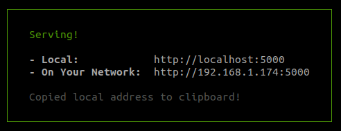

**TEN SECONDS MATH**

**Features**

**Usage**

To run the game in local, I have included Serve, a local server from an NPM library. 

Requeriments:

- node.js
- npm

Steps to open the server:

- Clone or download the repository in your computer.

- Type the following command in your terminal:

`~ npm start`

- Open the project trought the links are provided by the server.



```
   │   Serving!                                        │
   │                                                   │
   │   - Local:            http://localhost:5000       │
   │   - On Your Network:  http://192.168.1.174:5000   │
   │                                                   │
   │   Copied local address to clipboard!    
```

**What I learned**

**Resources**

For the sounds I used the library [flukeout.simple-sounds](https://github.com/flukeout/simple-sounds)
The local server is a library from NPM: [serve](https://www.npmjs.com/package/serve)
