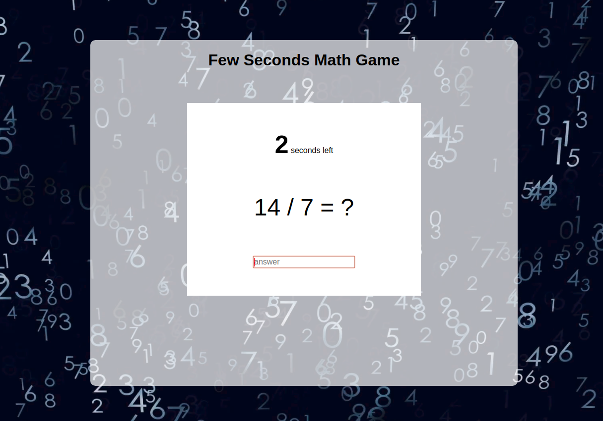

## FEW SECONDS MATH GAME

<p align="center">
  
</p>

Ten Seconds Math is a game created by Michael Jakob to challenge a person's mathematical skills against the clock.
In this project, I made my own version of this game changing some of it's features.

### **Features**

- At the beginning, the user has 10 seconds to answer the first math problem.
- The user chooses what type/s of math operations they will face: addition, substraction, multiplication or division.
- The user can limite the maximum number will appear.
- The most dificult operations provides more points (4 point for each division, 3 for multiplication, 2 for substraction and 1 for addition).
- The clock will start running once the first question is showed.
- The current question must be correctly answered to be allowed to answer the next.
- Every correct answer will add a **few seconds** more to the clock, depending on the difficulty selected (easy mode: +5 seconds, normal: +7 seconds, hard: +10)
- The user loses the game when the time is up! Don't let the clock run out!

### **Usage**

To run the game in local, I have included Serve, a local server from an NPM library.

- Install Node.js at the terminal if you haven't yet (https://nodejs.org/es/). Commands for Ubuntu:

```bash
sudo apt-get update
sudo apt-get install nodejs
```
- You will need to install the package manager npm:

```bash
sudo apt-get install npm
```
- Clone or download the repository in your computer.

```bash
git clone https://github.com/diana-moreno/few-seconds-math-game.git`
```
- Download the npm competitions in your own repository and start it.

```bash
npm install
npm start
```
- Open the project trought the links are provided by the server.

```
   │   Serving!                                        │
   │                                                   │
   │   - Local:            http://localhost:5000       │
   │   - On Your Network:  http://192.168.1.174:5000   │
   │                                                   │
   │   Copied local address to clipboard! 	       │
```
- Otherside, you can run the project here: https://diana-moreno.github.io/few-seconds-math-game/

### **What I learned**

- Run the project into a local server.
- Add sounds from a library adding scripts.
- Implement async and callback functions.
- How to switch to the next screen game with JS and CSS.
- Change style with CSS before and after.
- Create gitignore to hide some unnecessary local folders.
- How to vincule and edit a json file.

### **Resources**

- For the sounds I used the library [flukeout.simple-sounds](https://github.com/flukeout/simple-sounds).
- The local server is a library from NPM: [serve](https://www.npmjs.com/package/serve).
- Original idea from [then-seconds-math](http://www.mental-math-trainer.com/).
